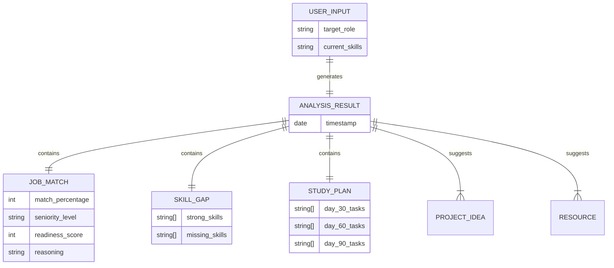

# Career Skill Gap Analyzer
### AI-Powered Career Coaching Platform

---

## 🛑 The Problem

*   **Uncertainty**: "Am I ready for this job?"
*   **Information Overload**: "What should I learn next?"
*   **Generic Advice**: "Learn React" is too broad.
*   **Resume Black Holes**: Applying without the right keywords.

---

## 💡 The Solution

**Career Skill Gap Analyzer** matches your *current skills* against your *target role* to provide an instant, data-driven reality check and a concrete roadmap to success.

---

## 📊 Logical Data Model (ER Diagram)

Since this application is real-time and stateless, this diagram represents the **Data Schema** relationship generated by the AI Analysis.

---

## ✨ Key Features

1.  **Smart Gap Analysis**: Not just keyword matching, but semantic understanding of your skill level.
2.  **30-60-90 Day Roadmap**: A structured study plan tailored to *your* missing skills.
3.  **Visual Dashboard**: Clear charts showing your "Match %" and "Readiness Score".
4.  **Resource Discovery**: Automatically finds projects, GitHub repos, and courses.

---

## 🛠️ Tech Stack

*   **Frontend**: React 18, Vite, Tailwind CSS
*   **Backend**: Python FastAPI
*   **AI Engine**: Ollama (Llama 3.2)

---

## 🚀 Future Scope

*   **Resume Parsing**: Upload PDF instead of manual entry.
*   **Live Job Search**: Integrate with LinkedIn/Indeed APIs.
*   **User Profiles**: Save history to database (SQL/NoSQL).

---

## 🎯 Conclusion

The **Career Skill Gap Analyzer** bridges the gap between *where you are* and *where you want to be*, turning anxiety into an action plan.
